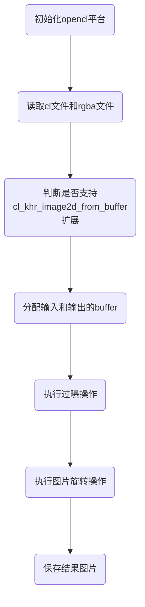

# Intel-Cpu-OpenCL-Runtime
### 简介：介绍如何安装使用Intel-Cpu-OpenCL-Runtime这个sdk进行opencl程序的开发，运行了实际的例子程序

## 1. 文件目录结构

```
├─cmake-build-debug------------编译debug版本的目录
│  └─release
├─cmake-build-release----------编译release版本的目录
│  └─release
├─common-----------------------写好的一些公共源代码文件
├─images-----------------------输入的图片文件
├─include----------------------包含的头文件
│  └─CL------------------------OpenCL的头文件
├─result-----------------------程序处理后的图片保存结果
└─script-----------------------编写的python脚本

```

## 2. Intel-Cpu-OpenCL-Runtime的SDK安装
- 确认安装的系统环境，是Linux还是Windows
- 下载对应的SDK安装程序，点击此处的[Intel-Cpu-OpenCL-SDK官网下载](https://www.intel.cn/content/www/cn/zh/developer/tools/opencl-cpu-runtime/overview.html)
- 下载之后可以一键运行安装程序


## 3. 编译指令说明

```bash
mkdir build
cd build
# 编译发布版，使用如下指令；如果是调试版本使用cmake -DCMAKE_BUILD_TYPE=Debug ..
cmake -DCMAKE_BUILD_TYPE=Release ..
cd release
test.exe
```


3.1. 运行结果说明

输入图片如下所示：


输出图片如下所示：


3.2. cpp工程的处理流程如下所示：



## 4. github工程下载

```bash

git clone https://github.com/pengzhikang/opencl-learning
cd imagefrombuffer
```
